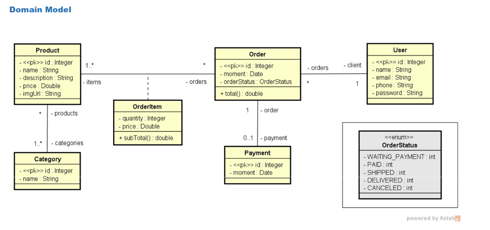
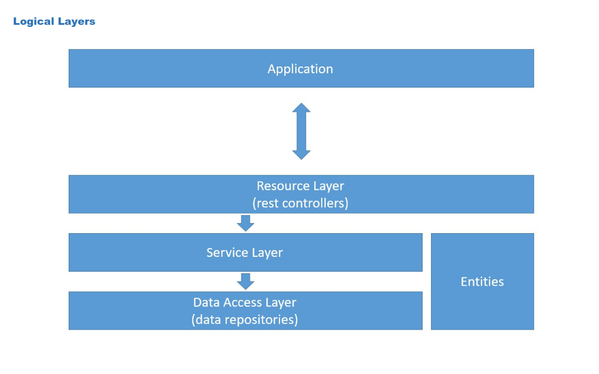

#  Workshop Spring Boot + JPA

A backend study project built with **Spring Boot** and **Spring Data JPA**, covering RESTful API design, domain modeling, and object-relational mapping with Hibernate.

---

##  About

This project was developed as part of a hands-on workshop focused on building a complete backend application using Java and the Spring ecosystem. It demonstrates how to model domain entities, persist them with JPA/Hibernate, and expose data through a RESTful API.

---

##  Technologies useds

- **Java 21**
- **Spring Boot**
- **Spring Data JPA / Hibernate**
- **H2 Database** 
- **Maven**

---

##  Domain Model

The application models a simple e-commerce domain with the following entities:

- **User** — represents a registered customer
- **Order** — a purchase order associated with a user
- **OrderItem** — line items of an order, linked to products
- **Product** — catalog item with category associations
- **Category** — classification of products
- **Payment** — payment record associated with an order

### Entity Relationships


---


### Logical Layer 


---

## ⚙️ How to Run

### Prerequisites

- Java 17 or higher
- Maven 3.6+

### Clone the repository

```bash
git clone https://github.com/AlcidesNeto32/workshop_springboot4-jpa.git
cd workshop_springboot4-jpa
```
---
### Run the application
  - Press the start button on your IDE.
  - OR
  - Start the application via terminal 
```bash
./mvnw spring-boot:run
```
The app will start at `http://localhost:8080`.

---
##  H2 Console

Access the in-memory database via browser:

```
http://localhost:8080/h2-console
```

| Field     | Value                |
|-----------|----------------------|
| JDBC URL  | `jdbc:h2:mem:databaseName` |
| User      | `sa`                 |
| Password  | *(leave blank)*      |

---

##  REST API Endpoints

### Users
| Method | Endpoint      | Description       |
|--------|---------------|-------------------|
| GET    | `/users`      | List all users    |
| GET    | `/users/{id}` | Get user by ID    |
| POST   | `/users`      | Create a new user |
| PUT    | `/users/{id}` | Update a user     |
| DELETE | `/users/{id}` | Delete a user     |

### Orders
| Method | Endpoint       | Description      |
|--------|----------------|------------------|
| GET    | `/orders`      | List all orders  |
| GET    | `/orders/{id}` | Get order by ID  |

### Products
| Method | Endpoint         | Description        |
|--------|------------------|--------------------|
| GET    | `/products`      | List all products  |
| GET    | `/products/{id}` | Get product by ID  |

### Categories
| Method | Endpoint           | Description          |
|--------|--------------------|----------------------|
| GET    | `/categories`      | List all categories  |
| GET    | `/categories/{id}` | Get category by ID   |

---

##  Project Structure

```
src/
└── main/
    ├── java/
    │   └── com/example/workshop/
    │       ├── config/          # Database seeding configuration
    │       ├── entities/        # JPA domain entities
    │       │   └── enums/       # Order status enums
    │       ├── repositories/    # Spring Data JPA repositories
    │       ├── resources/       # REST controllers
    │       │   └── exceptions/  # Exception handlers
    │       └── services/        # Business logic layer
                └── exceptions/  # Exceptions from the service
    └── resources/
        └── application.properties
        └── application-test.properties
```

---

##  Seeded Test Data

On startup, the application automatically populates the database with sample users, products, categories, orders, and payments — no manual setup needed.

---

##  License

MIT license.